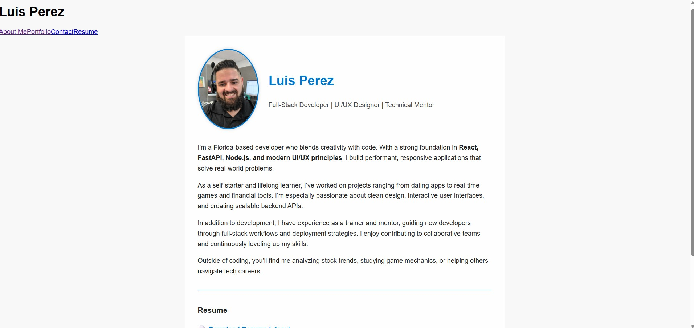

# 📁 Luis Perez — React Developer Portfolio

Welcome to my professional web developer portfolio, built with **React** and the **GitHub REST API**. This single-page application showcases my latest projects, skills, and experience, with repositories dynamically pulled from my GitHub profile to reflect my most up-to-date work.

> 🔗 **[View Live Portfolio](https://mellifluous-profiterole-d4893c.netlify.app/)**  
> *(Replace with your actual Netlify deployment link)*

---

## 📌 Table of Contents

- [Screenshots](#️-screenshots)
- [About the Project](#-about-the-project)
- [Features](#-features)
- [Technologies Used](#-technologies-used)
- [Installation](#-installation)
- [Getting Started](#-getting-started)
- [Project Structure](#-project-structure)
- [Credits](#-credits)
- [License](#-license)

---

## 🖼️ Screenshots

  

*Fully responsive layout for all screen sizes.*

---

## 📖 About the Project

This React-based single-page portfolio highlights my background as a developer. Visitors can:

- Learn more about me
- View and download my resume
- Browse dynamically loaded GitHub projects
- Contact me using a built-in form with validation

The application follows **mobile-first** and **responsive design** principles for performance and accessibility across all devices.

---

## ✨ Features

- ✅ Responsive, mobile-first layout  
- ✅ Dynamic project listings pulled from the GitHub REST API  
- ✅ “About Me” section featuring a bio and profile image  
- ✅ Resume download (.docx and .pdf formats)  
- ✅ Functional contact form with validation  
- ✅ Clean and modern UI using custom styling  
- ✅ Deployed using Netlify  

---

## 🛠 Technologies Used

- **React**
- **Vite**
- **GitHub REST API**
- **Netlify** (for deployment)
- **HTML5 / CSS3** (custom and inline styles)

---

## 🧩 Installation

To install and run this project locally:

Install dependencies:
bash
npm install

Start the development server:
bash
npm run dev

View the application:
Go to https://mellifluous-profiterole-d4893c.netlify.app/ in your browser.

🔁 Optional: Build for Production
bash
npm run build
This generates a production-ready version of the site in the /dist directory.

💻 Getting Started
Already covered in the Installation section above — but make sure you have:

Node.js and npm installed

A modern browser (Chrome, Firefox, etc.)

An internet connection (for GitHub API fetching)

## 🧱 Project Structure
php

react-portfolio/
│
├── public/
│   └── resume.pdf              # Public resume file
│
├── src/
│   ├── assets/                 # Images and resume preview
│   ├── components/             # Reusable components (Header, Footer, ProjectCard)
│   ├── pages/                  # Pages: About, Portfolio, Contact, Resume
│   ├── App.jsx                 # App-level routing
│   └── main.jsx                # Vite entry point

## 👤 Credits
Developed by Luis Perez

GitHub: @LPerez21

LinkedIn: linkedin.com/in/luis-perez (replace with your actual profile link)

## 📄 License
This project is licensed under the MIT License.
You are free to use, modify, and distribute it as part of your own portfolio or learning journey.